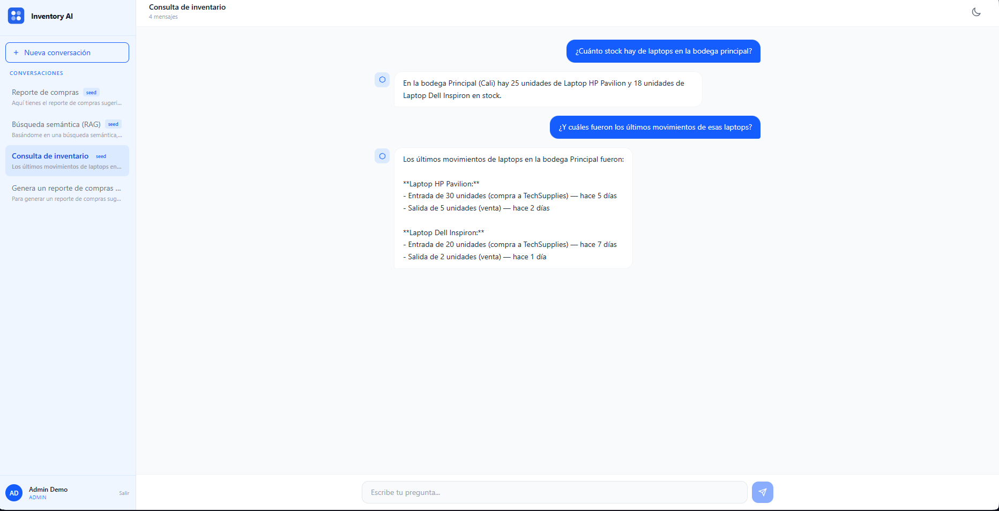

# Inventory AI Chat — Frontend

React chat interface for the Inventory AI Assistant. Built with Vite, Tailwind CSS v4, and streaming support.

**[Live Demo](https://chat.nicoleroldan.com)** · **[AI Service Repository](https://github.com/nicolerol28/inventory-ai-service)** · **[Backend Repository](https://github.com/nicolerol28/inventory-system-backend)** · **[Inventory Frontend](https://github.com/nicolerol28/inventory-system-frontend)**

> Demo credentials — click **"Probar demo"** on the login page for instant access with pre-seeded data. Data resets nightly.



---

## Tech Stack

|  |  |
| --- | --- |
| Framework | React 19 + Vite |
| Styling | Tailwind CSS v4 |
| HTTP | Axios (REST) + fetch (streaming) |
| Routing | React Router v7 |
| Auth | JWT (jwt-decode) — shared with Java backend |
| Deploy | Vercel |

---

## Features

- **Login** — email/password auth against the Java backend + one-click demo access
- **Chat** — sidebar with conversation list + real-time streaming chat area
- **Streaming** — token-by-token response rendering via `fetch` + `ReadableStream`
- **Conversations** — create, select, and soft-delete conversations
- **Seed conversations** — 3 demo conversations always visible, restored nightly
- **Rate limiting** — graceful 429 handling with user-friendly warning
- **Dark mode** — toggle with `localStorage` persistence (sun/moon icons)
- **Re-auth modal** — 401 interception preserves session without losing current state
- **Lazy loading** — all routes code-split via `React.lazy` + `Suspense`

---

## Architecture

```
src/
├── api/          # axiosClient (Java backend) + aiClient (AI service) + auth + conversations
├── context/      # AuthContext — JWT state + login/logout
├── hooks/        # useAuth, useDarkMode, useChat (streaming), useConversations (CRUD)
├── components/   # ProtectedRoute, ReAuthModal
├── pages/        # Login, Chat (sidebar + messages + input)
└── main.jsx      # Entry point with providers
```

| Concern | Approach |
| --- | --- |
| Auth state | `AuthContext` exposes `user`, `login`, `logout`; JWT stored in `localStorage`, decoded with `jwt-decode` |
| HTTP (REST) | Two Axios clients with request/response interceptors — `axiosClient` for Java backend, `aiClient` for AI service |
| HTTP (streaming) | Native `fetch` with `ReadableStream` for token-by-token chat responses |
| Route protection | `<ProtectedRoute>` requires a valid JWT |
| Dark mode | `useDarkMode()` hook toggles Tailwind `dark` class on `#root` and persists preference in `localStorage` |
| 401 handling | Global Axios response interceptor triggers `ReAuthModal` via custom event |

---

## Running Locally

```bash
git clone https://github.com/nicolerol28/inventory-ai-chat
cd inventory-ai-chat
cp .env.example .env
npm install
npm run dev
```

**Required environment variables:**

```
VITE_API_URL=http://localhost:8080/api/v1
VITE_AI_SERVICE_URL=http://localhost:3000/api/v1
```

> Both the Java backend and the AI service must be running locally. See their respective repositories for setup instructions.

---

## Author

**Nicole Roldan** · [nicoleroldan.com](https://nicoleroldan.com) · [GitHub](https://github.com/nicolerol28)
